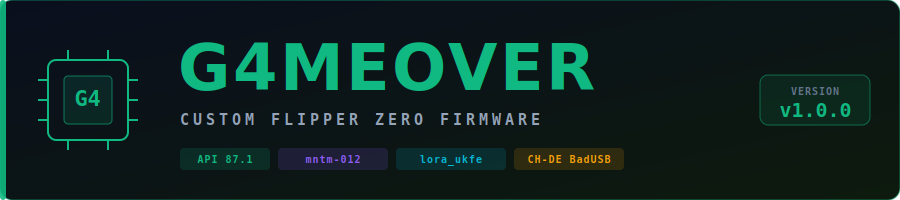

<p align="center">
  <picture>
    <source media="(prefers-color-scheme: dark)" srcset=".github/assets/logo_dark.svg">
    <source media="(prefers-color-scheme: light)" srcset=".github/assets/logo_light.svg">
    
  </picture>
</p>

<p align="center">
  <a href="https://github.com/G4MEOVER18/G4MEOVER-FW/releases/latest"></a>
  
  
  
  
</p>

---

## Was ist G4MEOVER-FW?

Custom Flipper Zero Firmware auf Basis von [Momentum Firmware](https://github.com/Next-Flip/Momentum-Firmware) (mntm-012, API 87.1). Vollständig auf das G4MEOVER Security Research Toolset umgebaut — eigenes Branding, integrierte LoRa-Remote-App und CH-DE BadUSB Support.

---

## Features

| Feature | Details |
|---|---|
| **G4MEOVER Branding** | Splash-Screen, 18-Frame Desktop-Animation, Menü-Icons |
| **lora_ukfe** | Flipper App für Remote-Steuerung des Heltec ESP32 LoRa v3 Agenten |
| **CH-DE BadUSB** | Schweizer Deutsch Tastaturlayout für BadUSB-Payloads |
| **lib/g4meover** | Forwarding-Header-Layer (g4meover.h, settings.h, asset_packs.h, namespoof.h) |
| **Momentum-Basis** | Alle Momentum Features erhalten (Asset Packs, Keybinds, SubGHz, etc.) |
| **523 externe FAPs** | Vollständige App-Bibliothek aus dem Momentum-Ecosystem |

---

## Installation

### Option A — qFlipper (empfohlen)

1. [Neuesten Release herunterladen](https://github.com/G4MEOVER18/G4MEOVER-FW/releases/latest) → `G4MEOVER-FW-vX.X.X-full.dfu`
2. qFlipper öffnen → **Install from file** → `.dfu` auswählen
3. Flipper anschliessen und flashen

### Option B — SD-Karte (OTA)

1. `G4MEOVER-FW-vX.X.X-sd-update.tgz` herunterladen und entpacken
2. Ordner `f7-update-g4meover-X.X.X/` → SD-Karte `/update/` kopieren
3. Flipper → **Einstellungen** → **Firmware-Update** → Ordner auswählen

---

## Companion Apps

### lora_ukfe — USB Army Knife Flipper Edition

> **[github.com/G4MEOVER18/lora-ukfe](https://github.com/G4MEOVER18/lora-ukfe)**

Flipper Zero FAP für die Remote-Steuerung des **Heltec ESP32 LoRa v3 Agenten** über UART/JSON (115200 Baud).

```
Flipper Zero  ──UART──►  Heltec ESP32 LoRa v3 (G4MEOVER UKFE Agent)
  lora_ukfe.fap              uart_bridge · lora_agent · wifi_suite
                             hid_engine · payload_store · oled_ui
```

**10 Menüpunkte:** Status · Trigger · Payloads · LoRa Scan · WiFi Scan · WiFi Deauth · Evil Portal · ABORT · Log · Einstellungen

---

## Build

```bash
# Toolchain: ARM GCC 12.3.1
# ufbt installieren: https://github.com/flipperdevices/flipperzero-ufbt

# Firmware bauen:
./fbt FIRMWARE_ORIGIN="G4MEOVER" DIST_SUFFIX="g4meover-1.0.0"

# Update-Paket bauen:
./fbt updater_package FIRMWARE_ORIGIN="G4MEOVER" DIST_SUFFIX="g4meover-1.0.0"

# lora_ukfe App bauen:
cd applications/external/lora_ukfe && ufbt
```

---

## Kompatibilität

| | |
|---|---|
| Hardware | Flipper Zero (F7) |
| Basis | Momentum Firmware mntm-012 |
| API | 87.1 |
| GCC | ARM GCC 12.3.1 (v39) |


---

## Verwandte Projekte

| Projekt | Beschreibung |
|---|---|
| [ProtoPirate](https://github.com/G4MEOVER18/ProtoPirate) | Car Keyfob RF Decoder/Emulator (27+ Protokolle) |
| [RollJam](https://github.com/G4MEOVER18/RollJam) | RollJam Attack PoC — CC1101 Jam + Capture + Replay |
| [RollLab](https://github.com/G4MEOVER18/RollLab) | Rolling Code Vulnerability Lab |
| [lora-ukfe](https://github.com/G4MEOVER18/lora-ukfe) | USB Army Penetrator — Remote-Control via Heltec ESP32 LoRa v3 |
---

## Rechtlicher Hinweis

Diese Firmware ist für **autorisierte Sicherheitstests, eigene Geräte und Security Research** bestimmt. Die Nutzung gegen Dritte ohne ausdrückliche Genehmigung ist illegal. Der Autor übernimmt keine Haftung.

---

## Support

Wenn dir das Projekt nützlich ist:

[](https://paypal.me/Freakbank1)
[](bitcoin:39vZWmnUwDReQ15BwqQXzyqVQ6U8LardEf)

```
BTC: 39vZWmnUwDReQ15BwqQXzyqVQ6U8LardEf
```

---

## Lizenz

GPL-3.0 — basiert auf [Momentum Firmware](https://github.com/Next-Flip/Momentum-Firmware) (GPL-3.0)

---

*[github.com/G4MEOVER18](https://github.com/G4MEOVER18) · G4MEOVER Security Toolchain*
